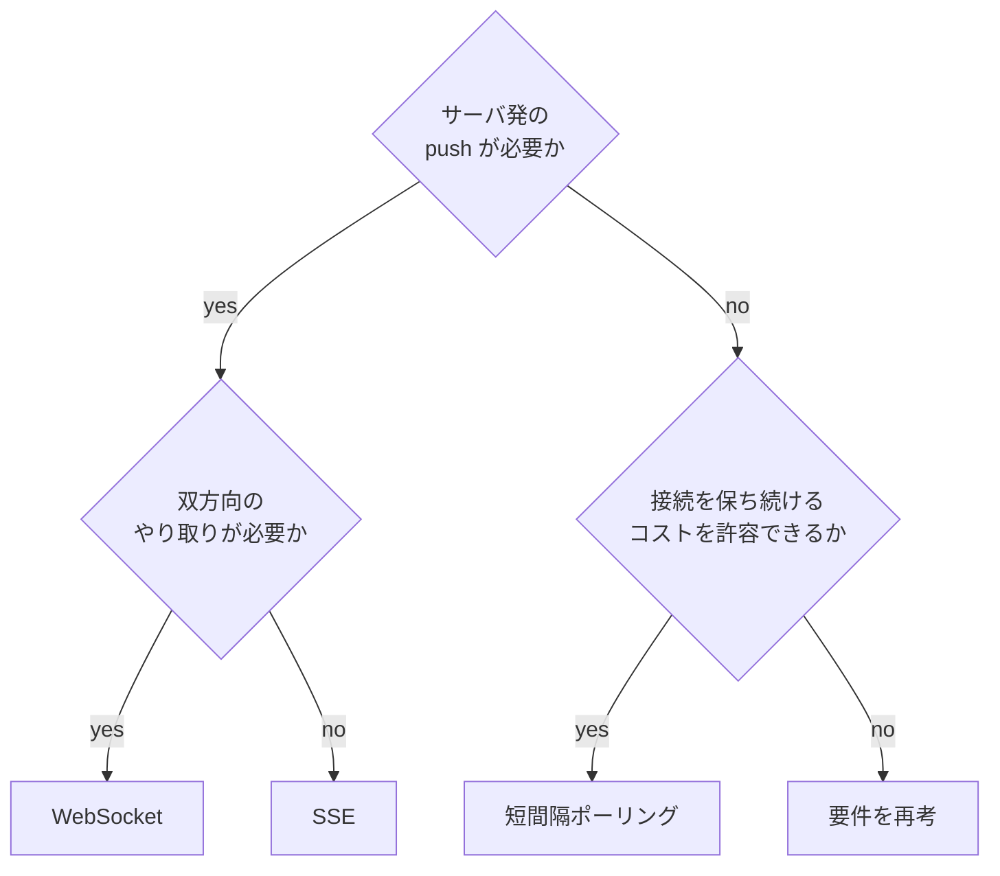
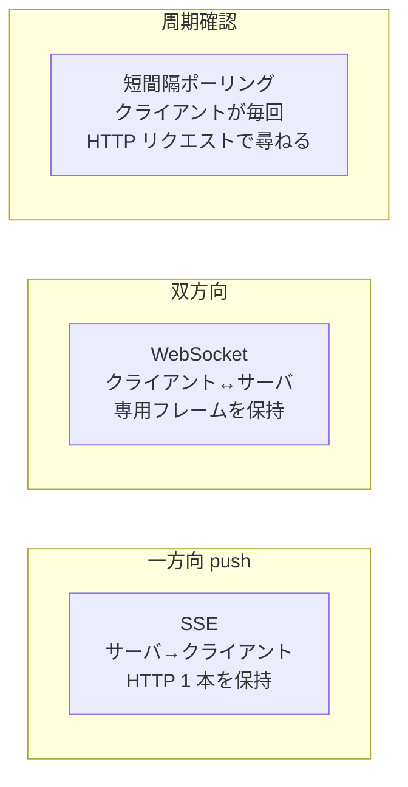

# 01 通信方式の使い分け判断軸

## 答える問い

サーバとクライアントの間でリアルタイムにデータをやり取りしたいとき、SSE と WebSocket と Polling のどれを選ぶか
判断軸は何で、それぞれの強みと弱みはどこにあるか

## 前提知識

HTTP の基本的なリクエストとレスポンスの 1 往復、TCP 接続を維持する場合のコスト感
ブラウザのタブとサーバの間で 1 本の長い接続を保つことが「コスト」になる感覚があれば読める

## 読了後に分かること

- SSE と WebSocket と Polling の 配信方向 と 接続維持コスト の違い
- 一方向 push が要るときと、双方向のやり取りが要るときの選び方
- 周期確認で十分なケースに長期接続を選ばない判断
- りもどき内 4 機能 と ルーム生命サイクル の選定根拠

## 図

## 解説

通信方式の選定で最初に立てる問いは「サーバ発の push が必要か」
push が必要なら接続を保ち続ける必要があり、SSE か WebSocket のどちらかになる
push が不要なら短間隔ポーリングで十分な場合が多く、長期接続のコストを払わずに済む

push が必要だと判断したあと、次の問いは「双方向のやり取りが必要か」
クライアント発の細かなコマンドを サーバに送る用途があれば WebSocket、サーバから流すだけで十分なら SSE
SSE は HTTP のレスポンス本体を閉じずに書き続けるだけで成立するため、プロキシや CDN との親和性が高く、自動再接続もブラウザ側が面倒を見てくれる

WebSocket は最初に HTTP で握手したあと専用フレームに切り替わるため、HTTP 経路に乗っている認証やキャッシュ層の挙動と決別する
これは強みでもあり弱みでもある、特に再接続戦略は自前で組む必要がある

push が不要なら短間隔ポーリングを選ぶ
たとえば「1 分に 1 回確認すれば十分」のような周期確認では、長期接続を維持するより HTTP リクエスト 1 回ずつのほうが運用が単純になる

「双方向ではないが SSE では足りないと感じる」と思ったときは、たいてい問題設定がずれている
SSE で取れない要件として よくあるのが「クライアントから細かい指示を流す」だが、これは別の HTTP エンドポイントで受ければ済むことが多い、その場合は WebSocket を選ぶ前に要件を再考する

りもどきでは 4 機能と ルーム生命サイクル の通知を、次のように振り分けている

| 機能 | 方式 | 選定理由 |
|---|---|---|
| Vibe — 在席と集中の状態 | SSE | サーバから状態変化を全員に流すだけで成立 |
| 作業音 — BGM の同期 | SSE | 変更時にサーバ側で展開して push |
| ひとこと — 短文の流れ込み | SSE | 一方向で十分、後から見返す前提も無し |
| 廊下トーク — 1 対 1 の雑談 | WebSocket | 招待や応答で双方向のやり取りが要る |
| ルーム生命サイクル | SSE 経由 | 入退室通知をルーム購読者に流すだけで足りる |

ルーム生命サイクルが「双方向に見えるが SSE 経由」になっているのは、ルームへの入室や退室そのものは別の HTTP エンドポイントが受け止めて、ルーム購読者への通知だけ SSE に流すという分業をしているから
この分業ができるかどうかも判断軸の 1 つで、できるなら無理に WebSocket を選ばない

## 用語ノート

**SSE** Server-Sent Events、HTTP のレスポンス本体を閉じずにサーバが書き続けることでサーバ発 push を成立させる仕組み、ブラウザは EventSource として受ける
**WebSocket** HTTP で握手したあと専用フレームに切り替わる双方向プロトコル、握手後は HTTP の経路の上で動かない
**Polling** クライアント側が定期的に HTTP リクエストを発行してサーバの状態を尋ねる方式、長期接続を保たない
**push** サーバの都合で配信を始めること、クライアントから尋ねた応答ではない配信のこと
**fanout** 1 つの publish を多数の subscriber へ配ること、詳しくは図 02 で扱う
**TCP 接続持続性** TCP コネクションを長時間張り続ける運用、サーバ側の同時接続数とプロキシのタイムアウト設定に効く

## 実装の踏み込み先

- 通信方式の抽象化 — backend の transport 層と frontend の libraries 層
- 機能ごとの選定 — Vibe と Murmur と BGM は SSE 系の broadcaster、Hallway は WS 系の broadcaster
