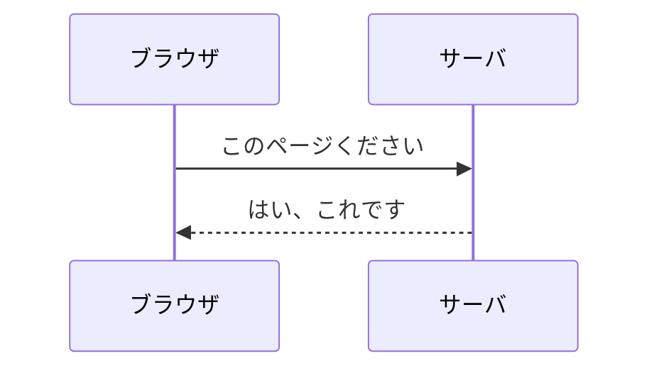
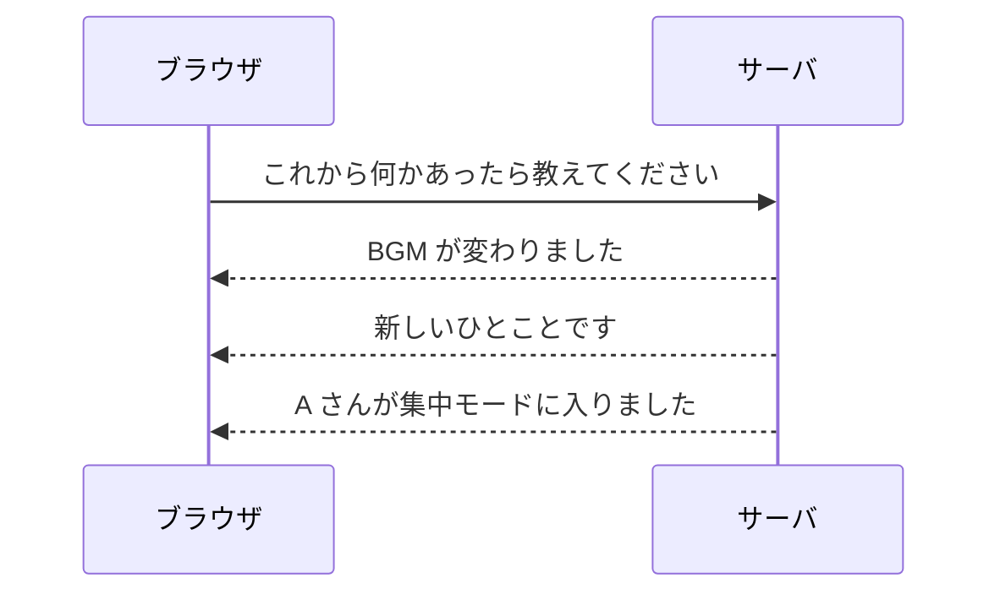

# 第 1 章 リアルタイムって何が起きているのか

## この章で答える問い

そもそも「リアルタイム」って何なんでしょうか

普段使っている Web は、ボタンを押せば次の画面に切り替わって、リクエストを投げれば返事が返ってくる仕組みになっています

一方で、Slack や Google Docs を開いていると、こちらが何もしていないのに誰かの発言が流れてきたり、隣で誰かが文字を打っているのが見えたりします

この「自分が操作していないのにサーバ側の出来事が画面に届く」感じが、リアルタイムと呼ばれているものの正体です

この章では、その違いを普段の Web との対比で言葉にしていきます

## 普段の Web は「聞いたら答える」会話

ブラウザとサーバがやり取りする一番基本の形は、HTTP のリクエストとレスポンスです

ブラウザがリクエストを送ると、サーバが処理して 1 回だけ返事を返します

「ブラウザが聞いて、サーバが答える」を繰り返す、会話のキャッチボールに似た形です

これだけだと、サーバが「新しい投稿が来た」と気付いても、それを画面に反映する手段がありません

ブラウザの側から「何か新しいことありますか」と聞きにいかない限り、画面は更新されないままです

## リアルタイムは「答えてからも話しかけてくる」会話

リアルタイム通信は、この会話の形を変えます

ブラウザが最初に「これからお願いします」と一度だけ声をかけると、サーバがその後ずっと話しかけ続けてくる、という形になります

ブラウザは画面を開きっぱなしにしているだけで、サーバ側で起きたことが勝手に届きます

「画面が勝手に動く」体験は、この通信の張り方によって作られています

## りもどきで体感できるリアルタイム

りもどきには、リアルタイム通信を肌で感じられる機能が 4 つあります

| 機能 | 体感 |
| --- | --- |
| 空気 | 自分は何もしていないのに、隣の人のアバターの色がふわっと変わる |
| 作業音 | 誰かが BGM を変えると、自分の画面の曲名表示も同時に切り替わる |
| ひとこと | 誰かが投稿した瞬間に、画面の下から「ぽこっ」とメッセージが流れてくる |
| 廊下トーク | 「話しかけたい」を押すと、相手の画面に通知が届き、応答すれば即座に通話が始まる |

どれも「自分のブラウザが何かをした結果」ではなく、「サーバ側で起きたことが伝わってきた結果」として画面が動きます

普段の Web の感覚だけで同じ動きを作ろうとすると、なかなか書けません

ブラウザが自分から定期的に聞きに行くやり方もあります

ただ、頻度を上げれば無駄なリクエストが増え、下げれば遅延が目立ちます

リアルタイム通信は、この「聞きに行かなくても届く」を、別の通信の張り方で実現する技術です

## ここで覚えておきたいこと

この章で押さえておきたいのは、ふたつだけです

ひとつめ、リアルタイムとは「自分が操作していないのに画面が勝手に動く」体験のことです

ふたつめ、その正体は、ブラウザとサーバの間で一度張った接続をそのまま開きっぱなしにして、サーバ側からも話しかけられる形に変えることです

「接続の張り方」にどんな種類があるのかを、第 2 章で 3 つに分けて見ていきます
