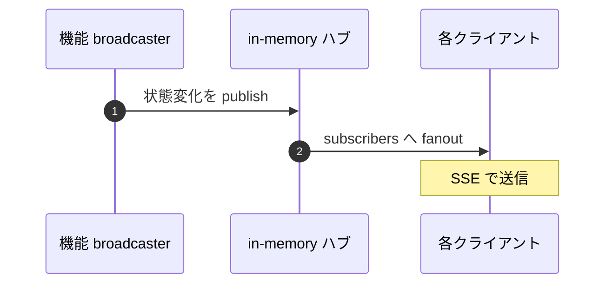
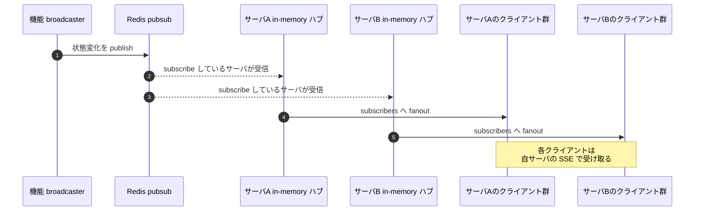

# 02 サーバ進化と fanout

## 答える問い

サーバが 1 台のうちは在席状態の変化や投稿を「全クライアントに配る」処理がメモリ内で完結する
これを 複数サーバ構成 に進化させると、同じ「全クライアントに配る」を どう実現するか
配信の経路は どこが増え、どこが変わるか

## 前提知識

図 01 の通信方式選択、特に SSE が「サーバから流すだけ」で成り立つ仕組み
pubsub という用語、誰かの publish が複数の subscriber に届く配送モデルの感覚

## 読了後に分かること

- 単一サーバの in-memory ハブで完結する fanout の構造
- 複数サーバになると fanout が pubsub を介して連鎖する理由
- 機能側の broadcaster と、cross backend の pubsub と、各サーバの in-memory ハブの責務分離
- 「sticky session が要らない」という性質が どう保たれるか

## 図

## 解説

単一サーバ構成では、在席や投稿の変化を 全クライアントに配る役割を ひとつの in-memory ハブが担う
broadcaster が状態変化を publish すると、ハブが その時点で subscribers として登録されている全クライアントへ fanout し、各クライアントは SSE で受け取る
全部が同じプロセスのメモリの中で起きるため、トピック という概念さえ正しく分けておけば、配信は単純な map 操作で済む

これを 複数サーバ構成 に進化させると、ある イベント を起こしたクライアントが繋いでいる サーバ と、その イベント を受けたい別のクライアントが繋いでいる サーバが 異なるケース が出てくる
このとき クライアント を サーバ に貼り付ける sticky session で凌ぐ手もあるが、入退室や招待のように 全員に配りたい イベント が混ざってくると 結局 サーバ間の通信が必要になる

そこで cross backend の pubsub を 1 段挟む
broadcaster は 自サーバの ハブに直接 publish するのではなく pubsub に publish する
各サーバは pubsub を subscribe しておき、流れてきた イベント を 自サーバの ハブに渡し、ハブが 自サーバの subscribers へ fanout する
配信の連鎖は「broadcaster → pubsub → 各サーバ → 各サーバの ハブ → 各サーバのクライアント」という 2 段構造になる

責務はきれいに 3 つに分かれる
機能 broadcaster は「何が起きたか」を ドメインの語彙で publish する
pubsub は「サーバを跨いで配る」だけを担い、トピック単位 で配る対象を絞る
各サーバの ハブは「自サーバ内の subscribers にだけ届ける」を担う

この構造の良いところは、機能 broadcaster と クライアント の関係が 単一サーバ時代と同じ抽象度で書けること
broadcaster は 自分が どのサーバに居るか、購読者が どのサーバに居るかを 気にしなくてよい、pubsub に publish するだけで「全員に届く」が成り立つ
sticky session も要らない、ロードバランサは クライアント を 任意の サーバに振っていい

トピックの粒度は 機能ごと や ルームごと に切る
りもどきでは 機能 と ルーム の組合せをトピックに使い、ルームに居ない人へ無関係な イベント を流さないようにしている
各サーバの ハブが受け取った後で フィルタするより、pubsub の段階で トピック を絞るほうが 経路全体の負荷が軽いため

## 用語ノート

**in-memory ハブ** ひとつのプロセス内で subscribers を覚えて publish を全員に配る簡易な配信機構
map とコールバック登録だけで作れる

**pubsub** publisher がトピックに publish し、subscribers がトピックを購読して受け取る配送モデル
Redis では pubsub コマンドで提供される

**トピック** 配信を絞り込むためのラベル
機能名やルーム名を組み合わせて使うことが多い

**fanout** 1 つの publish を多数の subscribers に届けること
ハブや pubsub が担う中心的な仕事

**subscribe** 「このトピックを受けたい」と購読者として登録する操作

**cross backend** 別のサーバプロセスを跨ぐ通信
in-memory では成立せず外部の pubsub などが必要

**sticky session** 同じクライアントを毎回同じサーバに振るロードバランサ設定
本図の構造ではこれが不要になる

## 実装の踏み込み先

- 機能 broadcaster（backend の application 層、Vibe と Murmur と BGM と Hallway の各 broadcaster）
- 抽象化（backend の infrastructure 層 pubsub、in-memory 実装と Redis 実装が ports に揃う）
- 各サーバの in-memory ハブ（backend の infrastructure 層 transport、SSE と WS で別々のハブを持つ）
