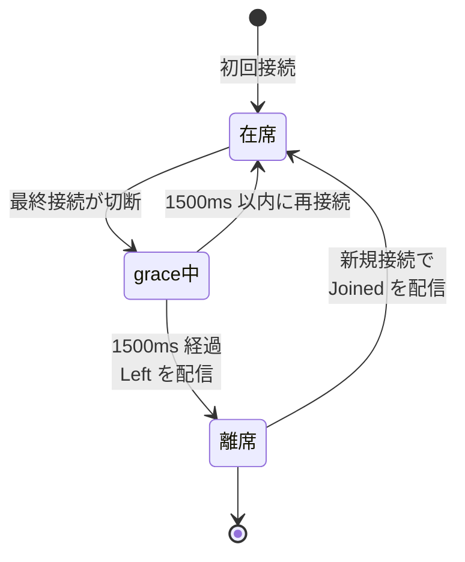
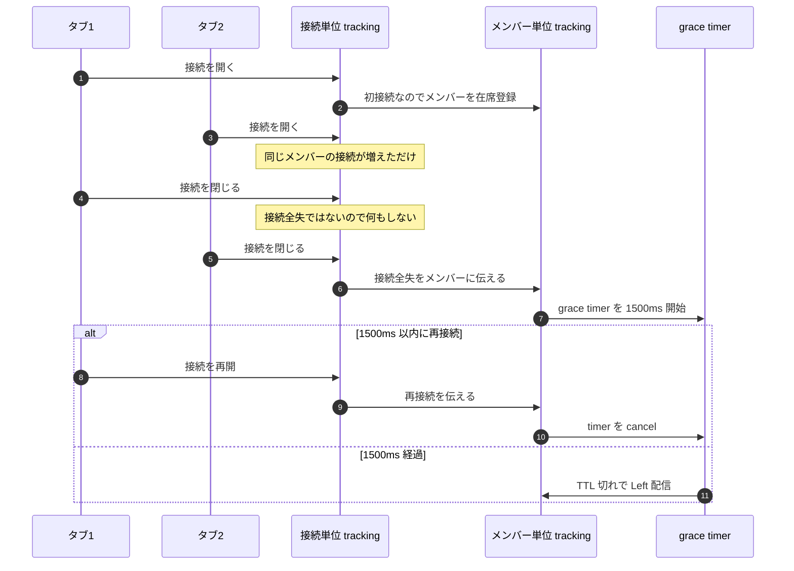

# 03 在席判定の grace パターン

## 答える問い

ネットワークの瞬間的な揺らぎで切断と再接続が繰り返されるとき、それを「離席した」と判断せず継続在席として扱う仕組みは何か
1 メンバーが複数のタブで繋いでいるとき、各タブの増減を どう扱うか

## 前提知識

図 02 の fanout、特に複数サーバ構成での pubsub 経路
TTL の概念、書き込んだキーが指定時間で自動消去されること

## 読了後に分かること

- 接続単位 tracking と メンバー単位 tracking を 2 段で持つ理由
- 切断時に即「離席」と判定せず grace を 1500ms 待つ理由
- grace 中に再接続が来たときの cancel の流れ
- 1 メンバーが 複数タブ で繋いでいるときの集約

## 図

## 解説

在席判定の難しさは、ネットワークの揺らぎ や 短時間の リロード が混ざると 「本当に離席したか」を 切断 1 回では決められないこと
1 度の切断を即「離席」と扱うと、無線が一瞬切れただけ や ページ遷移を挟んだ短時間の reconnect で 「居なくなった と思ったら また居た」が 連続で起きて UI がちらつく

これを抑えるために、切断と離席の間に grace timer を 1 段挟む
切断が来た瞬間は 「grace 中」という中間状態に置き、grace timer の TTL が切れる前に 再接続が来れば cancel する
TTL が切れたら はじめて 「離席」と判定して Left を全員に配る

もう 1 つの工夫は、tracking を 2 段に分けること
1 段目は 接続単位 tracking で、各接続の 開閉 を そのまま反映する
2 段目は メンバー単位 tracking で、メンバー が 1 本以上 接続を持っているか を保持する
2 段に分けると 「接続が増減したけれどメンバーは居続ける」を 矛盾なく扱える

メンバー単位 tracking から見ると、接続の増減は 「初接続」と「最終接続が切れた」の 2 つの境界だけが意味を持つ
初接続でメンバーを 在席に登録、最終接続が切れたタイミングで grace timer を 1500ms 仕掛ける
途中の増減は メンバー単位 では見えなくていい

grace timer は 「猶予期間」の意味で、ネットワーク揺らぎの吸収幅を決める
短すぎると 揺らぎを吸収できず、ちらつきが残る
長すぎると 「離席したのに 在席に見える」時間が伸びる、退室時の挙動が鈍くなる
1500ms はその折衷で、リロード や 短時間の reconnect は確実に吸収しつつ、明示的な閉じには ほぼ即時で反応できる落とし所として選ばれている

複数タブのケースは 接続単位 tracking が自然に吸収する
タブ A を閉じても タブ B が残っていれば メンバー単位 では「最終接続切れ」にならず、grace timer は仕掛からない
全タブを閉じて はじめて 1500ms の grace に入り、これは 1 タブ運用と同じ挙動になる

複数サーバ構成では grace timer の制御を 1 instance だけが担当する必要がある、これは 図 04 の dispatch の決定論性 で扱う
ここでは「在席の判定モデルは 接続単位 と メンバー単位 の 2 段に分け、間に grace を挟む」という構造だけを覚えていれば十分

## 用語ノート

**grace timer** 切断を検知してから 「本当に離席か」を確定するまでの猶予タイマー、TTL key として表現することが多い
**接続単位 tracking** 各接続の 開閉 を そのまま記録する側、Hash の field 増減で表すと 自然にカウントできる
**メンバー単位 tracking** メンバー が 1 本以上 接続を持っているかを保持する側、Set への 追加 と 削除 で表せる
**初接続** メンバーが 0 接続の状態から 1 接続めを開いた瞬間、ここで Joined を流す
**最終接続切れ** メンバーの 接続が 全部消えた瞬間、ここから grace timer を仕掛ける
**ちらつき** 短時間で Joined と Left が往復することによる UI の点滅、grace の主目的はこれを抑えること

## 実装の踏み込み先

- 在席判定の本体（backend の application 層 Vibe の usecase 群、特に grace の制御）
- 接続単位とメンバー単位の保管（backend の infrastructure 層 presence、in-memory 実装と Redis 実装が ports に揃う）
- frontend 側の購読（frontend の features 層 Vibe、SSE で Joined と Left と Updated を受ける）
