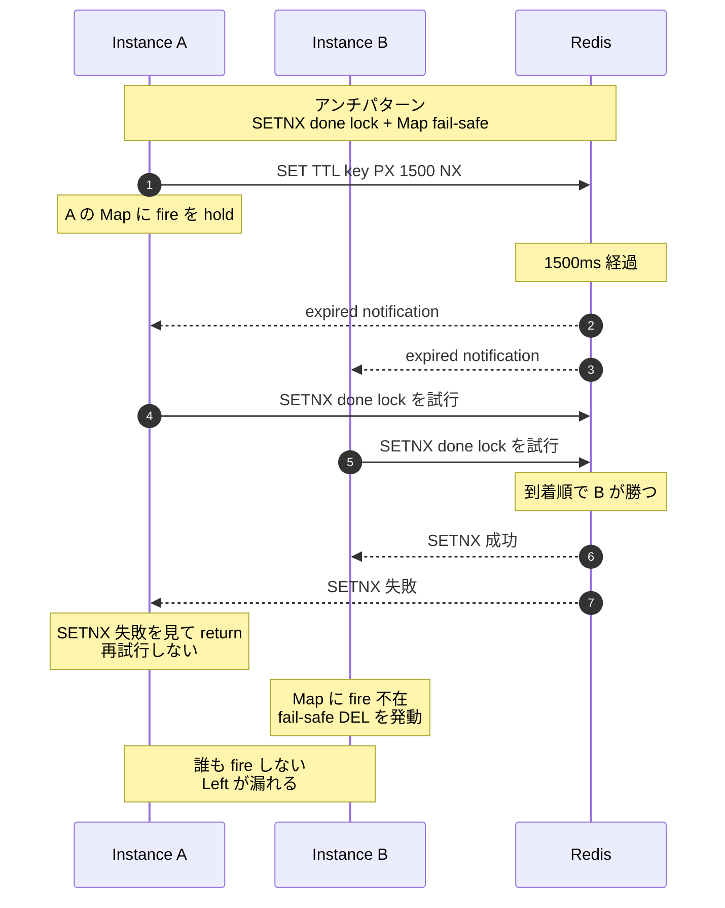
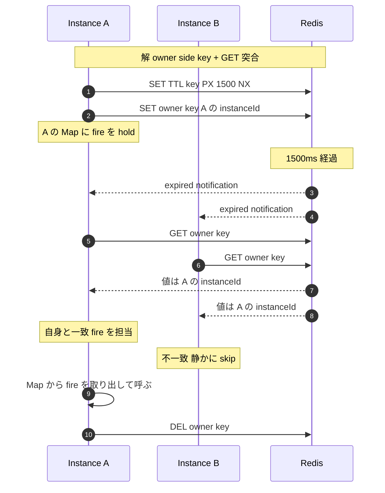

# 04 多 instance dispatch の決定論性

## 答える問い

複数 instance が同じ TTL key の expired notification を 同時に受け取ったとき、「1 instance だけが fire を担当する」を どう確実に決めるか
SETNX を使った素直な設計で起きる構造的な race の正体は何か、それを どう避けるか

## 前提知識

図 02 の Redis pubsub、TTL key の挙動と keyspace notification の届き方
図 03 の grace timer、その制御を 多 instance 環境で誰が握るかという問題意識

## 読了後に分かること

- TTL key と keyspace notification を組み合わせた scheduling の使い方
- SETNX done lock と Map fail-safe を組み合わせる設計が 構造的に race する理由
- owner side key と GET 突合 で 競合ゼロの dispatch を取る方法
- schedule 時点で「誰が責任を持つか」を書いておく価値

## 図

## 解説

複数 instance で 同じ TTL key の expired notification を受けるとき、素朴に思いつく「誰かが done lock を取れば残りは降りる」設計は 構造的な race を抱える
race の本体は 「lock を取れた側が fire を持っているとは限らない」という事実

具体的に追うと、Instance A が schedule した TTL key の expired を Instance A と Instance B が 同時に受ける
B のほうが Redis への到着が一瞬早ければ B が SETNX に勝ち、A は SETNX に負けて return する
だが fire callback は schedule した A の Map にしか居ない、勝った B には fire が無い
B は fail-safe として done lock を DEL するが、A は すでに return しており再試行はしない、Redis 側にも自動再 dispatch の機構は無い
結果、誰も fire しないまま expired が消えていく、Left の配信や grace 切れ後の処理が 「たまに無かったことになる」

この race の根本原因は、 lock の取り合いを「実際に fire を持っている責任側」とは独立に走らせていること
責任が誰にあるかを 取り合いで決めると、fire を持つ側が 必ずしも勝者になるとは限らない、ここに確率的決定が紛れ込む

解は、 schedule 時点で「誰が責任を持つか」を Redis 側に書いておくこと
schedule の瞬間に、本体の TTL key と並行で owner side key に instanceId を書く
expired notification を受けた各 instance は GET owner key を 1 度だけ叩き、自身の instanceId と一致したら fire を担当、不一致なら 静かに skip する
取り合いが消え、確率的決定が消え、配信は 1 度だけ行われる

owner key の TTL は 本体 TTL より少し長く取る、expired notification が届いて GET する間に owner key が先に消えてしまう事故を避けるため
fire 担当が決まったあと owner key を DEL すれば 残骸も残らない

cancel もシンプルになる
schedule した側が cancel 時に 本体 TTL key と owner key の両方を DEL するだけで、まだ expired が走っていないなら そもそも何も起きないし、走り始めていても owner 不在で全 instance が skip するので副作用が無い

re schedule への耐性も自然に出る
本体 TTL key は NX 付きで上書きを禁じ、owner key は NX なしで上書き可能にしておく
同じ key に対する re schedule で、所有権は最後に書いた instance に移る、これは grace timer の延長や 移し替えの自然な意味と一致する

「自身と一致したが Map に fire が無い」という edge case は、instance の再起動を跨ぐような 限定的な状況で起きうる
このときは owner key を DEL して 静かに終わる、正常系の動きには影響しない

## 用語ノート

**TTL key** Redis に書き込んだキーが指定したミリ秒で自動消去される仕組み
タイマーの代用として使う

**keyspace notification** Redis のキー消去の瞬間に購読者へ通知が飛ぶ機能
ポーリングなしで「あの key の TTL が切れた」を知れる

**SETNX** Redis の操作の 1 つで、まだ存在しないときだけ書き込む条件付き SET
lock の素材としてよく使われる

**done lock** 「誰が fire を担当したか」を取り合いで決めるための排他キー
本図のアンチパターンの中心

**Map fail-safe** 勝者の Map に fire が無かったときの保険として done lock を消し戻す動作
本図ではこれが 「敗者は再試行しない」 性質と噛み合わずに機能不全になる

**instanceId** 起動時に instance ごとに 1 度生成する一意な識別子
ログや owner side key に使う

**owner side key** 「誰が責任を持つか」を別キーに instanceId として書いておき、各 instance が GET で見て自分の責任か判定する設計
競合がそもそも発生しない

**deterministic dispatch** 「誰が処理するか」が race なしに必ず 1 通りに決まる配信
確率的決定の対極

## 実装の踏み込み先

- 採用箇所（backend の infrastructure 層 timer、Vibe の grace timer、Hallway の招待タイマー、ルーム生命サイクルの grace timer の 3 つに同じ owner side key 方式を適用）
- 抽象化（backend の infrastructure 層 timer、in-memory 実装と Redis 実装が ports に揃う、in-memory では owner key 概念は省略してよい）
