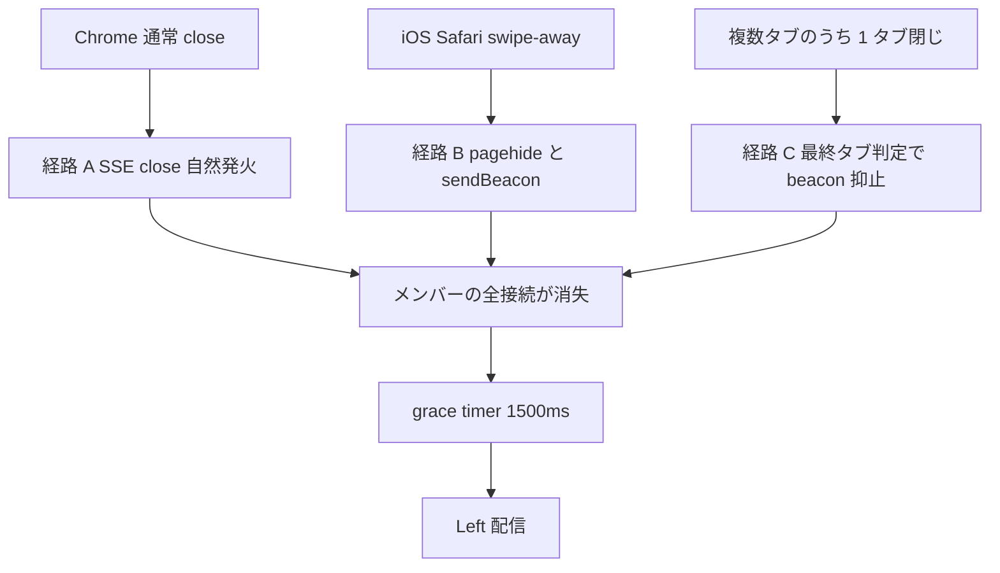
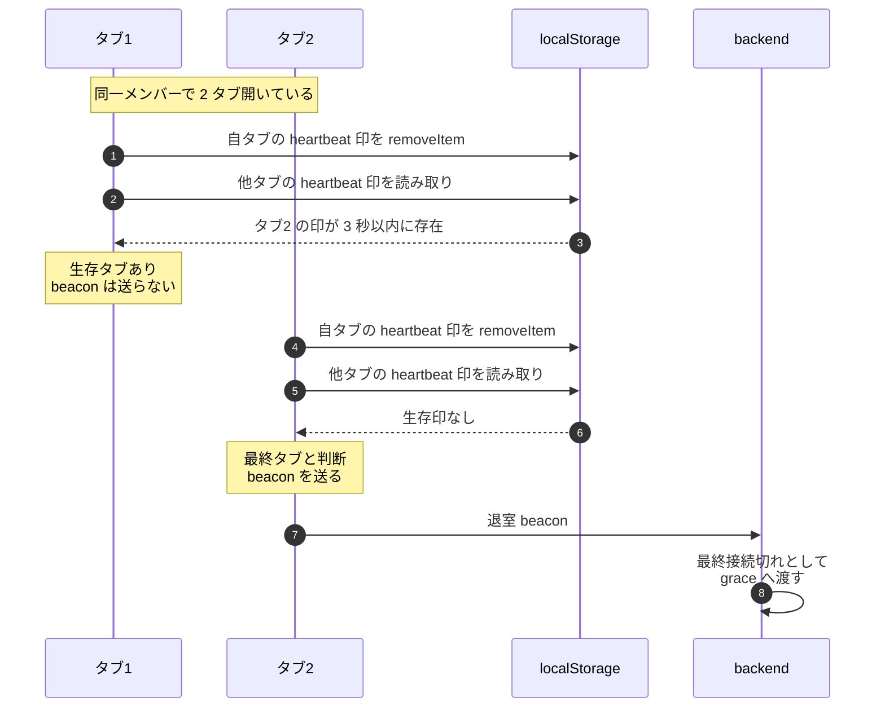

# 05 退室シグナル経路の重ね合わせ

## 答える問い

ブラウザの閉じ方は環境ごとに違う、Chrome の通常 close、iOS Safari の swipe-away、複数タブをまとめて閉じるケースなど
これらをそれぞれ拾える経路は別々にある、3 経路を どう協調させて 1 つのクリーンアップに集約するか
複数タブ環境で 「他のタブが残っているのに 1 タブ閉じただけで全員に Left が出てちらつく」 を どう避けるか

## 前提知識

図 03 の grace パターン、最終接続切れから grace timer に入る流れ
SSE の 自然な close と pagehide の差、ブラウザのライフサイクルイベント

## 読了後に分かること

- SSE の close が 拾える条件と拾えない条件
- iOS Safari の swipe-away で SSE の close が発火しない問題と、その救済としての pagehide と sendBeacon
- 複数タブで beacon を素朴に撃つと 他タブにフリッカーが起きる構造
- localStorage ハートビートと最終タブ判定で iOS 救済とフリッカー抑止を両立する仕組み

## 図

## 解説

退室シグナルの難しさは、ブラウザの閉じ方が環境ごとに違うこと
Chrome の通常 close なら SSE の自然な close が backend に届き、それを最終接続切れとして扱える
ところが iOS Safari の swipe-away はアプリケーションの実行を一気に止めるため、SSE の close が backend に届かない経路がある
この経路だけだと、iOS 上のメンバーが消えても backend 側では「接続が切れた」と分からず、いつまでも在席のまま残る

iOS の救済として pagehide と beacon を組み合わせる
pagehide はページが閉じる または隠れる瞬間に発火するイベントで、unload より発火率が高くモバイルでも信頼できる
pagehide の中で beacon API を使うと、タブが死ぬ瞬間でも 短いリクエストを 1 本投げて backend に「閉じた」と伝えられる、これで iOS swipe-away も拾える

ところが pagehide と beacon を素朴に撃つと、別の問題が出る
複数タブで同じメンバーが繋いでいるとき、1 タブだけ閉じた瞬間にも beacon が飛ぶ
backend は beacon を「メンバーの最終接続切れ」と扱ってしまい、まだ別タブで繋いでいるはずのメンバーに 一瞬 Left が出てから 次のイベントで Joined が出る、UI がちらつく

この問題は 接続単位 tracking では救えない
beacon の中身に「接続 ID」を載せていない構造なら backend 側からは どの接続を閉じたか 区別できない、たとえ載せていても backend 側で 接続 ID と pagehide のタイミングを正確に対応づけるのは難しい
解は frontend 側で「最終タブかどうか」を判定して、最終タブのときだけ beacon を撃つこと

最終タブ判定は localStorage を共有メモリとして使う
各タブは 短い周期で localStorage に 自タブの heartbeat 印を書く、印には自タブの ID と書いた時刻を入れる
ある タブが pagehide で閉じる瞬間、次の手順で 最終タブかを判定する

1. 自タブの heartbeat 印を localStorage から removeItem する
2. 他タブの heartbeat 印を読み取る、自タブ以外の印で 3 秒以内に書かれたものがあれば 「生存タブあり」
3. 生存タブが 1 つでも見つかれば beacon は送らない、見つからなければ 自分が最終タブなので beacon を送る

3 秒の幅は heartbeat の周期より十分長く取る、書き込みの揺らぎや タブ間の同期遅れを吸収するため
removeItem を最初に行うのは 自タブを判定対象から外すため、自分自身の印を生存とみなして判定が壊れる事故を避ける

経路の集約は backend の grace ロジックで自然に行える
SSE close と pagehide beacon は別々の経路だが、どちらも 「メンバーの最終接続切れ」 という 1 つの概念に落ちるよう backend 側で集約しておけば、grace timer 以降の処理は 経路を意識せずに済む

BFCache に入る挙動も この設計でうまく回る
ページが BFCache に入って瞬間冷凍された場合、ページは生きている扱いだが SSE 接続は切れていることが多い
BFCache から戻ったら SSE の再接続が走り、接続単位 tracking の増減として処理される、これは 図 03 の grace の枠内で吸収される

## 用語ノート

**SSE close 自然発火** SSE の HTTP レスポンス本体が閉じる瞬間に backend が検知できる経路、Chrome の通常 close では確実に発火する
**pagehide** ブラウザでページが閉じられる または隠れる瞬間に発火するイベント、unload より発火率が高くモバイルでも信頼できる
**sendBeacon** タブが死ぬ瞬間でも短いリクエストを 1 本投げられるブラウザ API、応答は受け取らない fire and forget の用途に向く
**iOS Safari swipe-away** ホーム画面に戻すジェスチャでタブを閉じる操作、アプリケーション実行を一気に止めるため SSE close が backend に届かない経路がある
**フリッカー** UI が瞬間的に Left と Joined を行き来して チラつくこと、複数タブで beacon を素朴に撃つと起きる
**localStorage ハートビート** 各タブが定期的に localStorage へ自タブの存在印を書く仕組み、最終タブ判定の素材になる
**最終タブ判定** 自タブを除いた生存印を localStorage で確認して 自分が最後の 1 タブかを判断する処理
**BFCache** ページが瞬間冷凍されて戻れる仕組み、戻ったときに JS 状態が保たれる、ただしアクティブ接続を持つページは普通 BFCache に入らない

## 実装の踏み込み先

- 退室経路の集約（backend の application 層 ルーム生命サイクル、最終接続切れを 1 経路に寄せる）
- 接続単位 tracking（backend の infrastructure 層 presence、SSE close と beacon を同じ抽象に乗せる）
- frontend 側の最終タブ判定（frontend の features 層 ルーム退室、pagehide で localStorage を見る処理）
