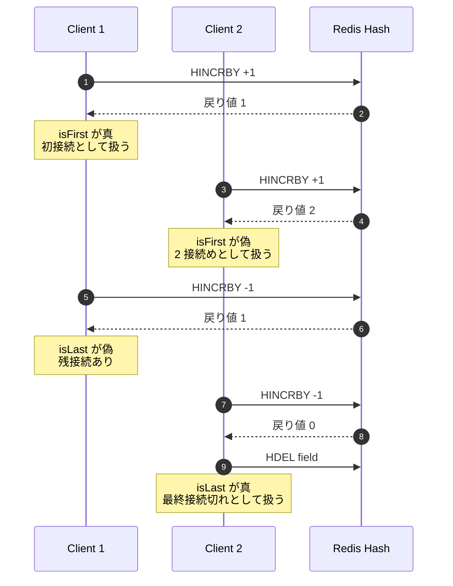
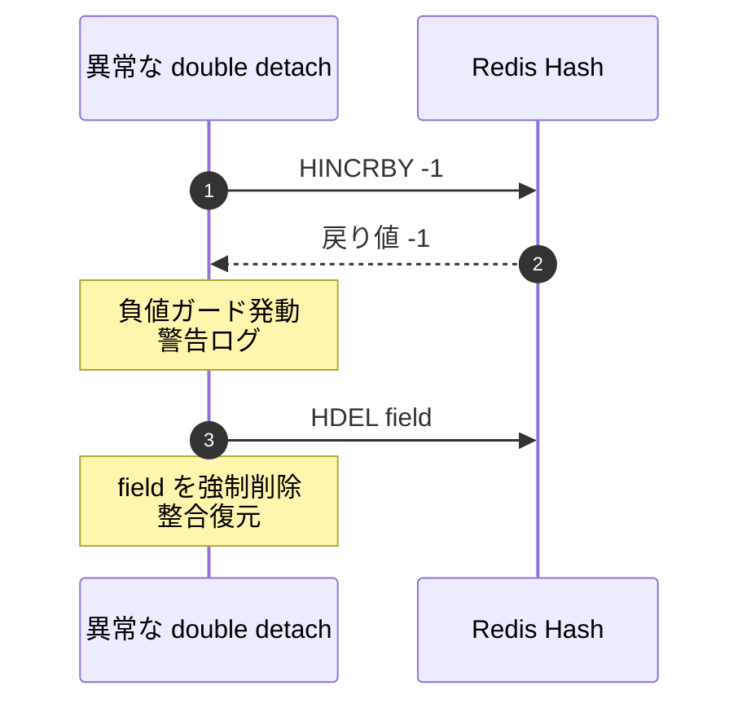

# 06 多 instance での接続数集計

## 答える問い

複数 instance で 同じメンバーの接続数 を 競合なく atomic に集計するには 何を使うか
1 接続めかどうか、最終接続が切れたかどうかを どう即時に判定するか
そもそも 図 04 の dispatch とは どこが違うのか

## 前提知識

図 02 の Redis pubsub、図 04 の dispatch との対比
Hash というデータ構造の感覚、key の中に 複数の field を持てる連想配列のような形

## 読了後に分かること

- HINCRBY による atomic な増減の動作
- isFirst と isLast を 戻り値だけで即時に判定する方法
- 0 到達時の field 掃除と、稀に起きる double detach 異常 への防御
- dispatch（1 instance pick）と counter（all instance collaborate）の役割の違い

## 図

## 解説

複数 instance が ばらばらに 同じメンバーの接続を増減させるとき、各 instance が ローカル変数で カウントを持つ作りでは 値が必ず ずれる
別 instance の増減を ローカル変数は知らないし、伝聞で同期しても タイミングのずれで ダブルカウントや 取りこぼしが入る
ここに 「atomic な増減」が要る、Redis の HINCRBY が この用途に綺麗にハマる

HINCRBY は Hash の field の値に 指定した整数を atomic に加える操作で、操作後の値を 戻り値として返す
複数の instance が 同時に HINCRBY を撃っても、Redis 側で 直列化されるため 最終的な値は 増分の総和として正しく確定する
さらに 戻り値で 「自分の操作の結果として何になったか」が分かるため、別途 GET で 値を確認するラウンドが要らない

接続を attach するときは HINCRBY +1 を撃ち、戻り値が 1 なら 自分が 初接続を作った instance だと分かる、これが isFirst
接続を detach するときは HINCRBY -1 を撃ち、戻り値が 0 なら 自分が 最終接続を片付けた instance だと分かる、これが isLast
isFirst の側は Joined を流す責任を取り、isLast の側は 最終接続切れとして grace timer に渡す責任を取る

戻り値が 0 になったら HDEL で field を消しておくと、値の中に 0 という field が残り続けるのを防げて 後始末がきれい
実装上は HINCRBY -1 で 0 が返ったら 即 HDEL を呼ぶ、これは race を起こさない
仮に 別 instance が この間に attach して 戻り値 1 を取っていれば、HDEL は 1 になっている field を消すことになるが、そのときは 別 instance 側で 直前の HINCRBY で field を作り直しているはずなので 過渡的な不整合は あっても次の操作で復元される

異常系として double detach は防御しておく
仕様上は detach が attach の数より多く走ることは起きないはずだが、再接続失敗の取扱いミスや 起動順の事故で 戻り値が -1 や それ以下になることが ごく稀にある
このときは 警告ログを出して HDEL で field を強制削除し、負値の状態を引きずらないようにする、整合性を 「次の attach で 1 から再開」 まで戻す

dispatch（図 04）との違いを意識すると 設計の住み分けがよく見える
dispatch は 「1 instance だけが処理を担当する」 が要件、つまり 全員協力ではなく 1 人選定
counter は 「全 instance の操作を atomic に積み上げる」 が要件、つまり 全員協力で 1 つの値を作る
前者は owner side key + GET で 確率的決定を排除する、後者は HINCRBY の atomic 性で 競合なく総和を取る
両者は 同じ Redis を使うが、要件と道具が 別物だと知っておくと 設計が混ざらずに済む

## 用語ノート

**atomic** 操作の途中状態が 他から見えず、必ず 「全部やった」 か 「全部やってない」 かのどちらかになる性質、HINCRBY は Redis サーバ内で 直列化される
**HINCRBY** Redis Hash の field の値を atomic に増減する操作、整数のみ、戻り値は操作後の値
**HDEL** Redis Hash の field を消す操作、0 になった counter を後始末するときに使う
**Hash field** Redis Hash の中の 1 要素、key 1 本の中に 複数の field を持てるため メンバーごとの値を 1 key に集約できる
**isFirst** HINCRBY +1 の戻り値が 1 だった瞬間、メンバーの 初接続として扱う
**isLast** HINCRBY -1 の戻り値が 0 だった瞬間、メンバーの 最終接続切れとして扱う
**double detach 異常** 同じ接続を 2 回 detach してしまったような取扱いミス、戻り値が 負になることで検知できる
**counter と dispatch の住み分け** counter は 全員協力で 1 つの値を作る、dispatch は 1 人選定する、要件が違うので使う primitive も別

## 実装の踏み込み先

- 接続数集計（backend の infrastructure 層 counter、Hallway の WS 接続数を Redis Hash で持つ）
- 抽象化（backend の infrastructure 層 counter、in-memory 実装と Redis 実装が ports に揃う）
