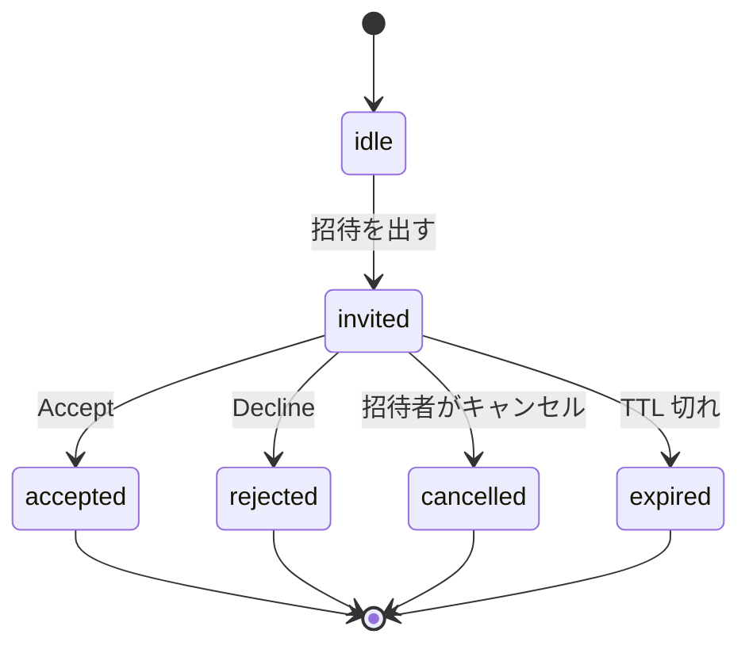
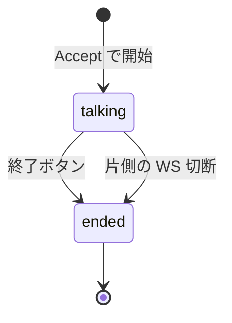
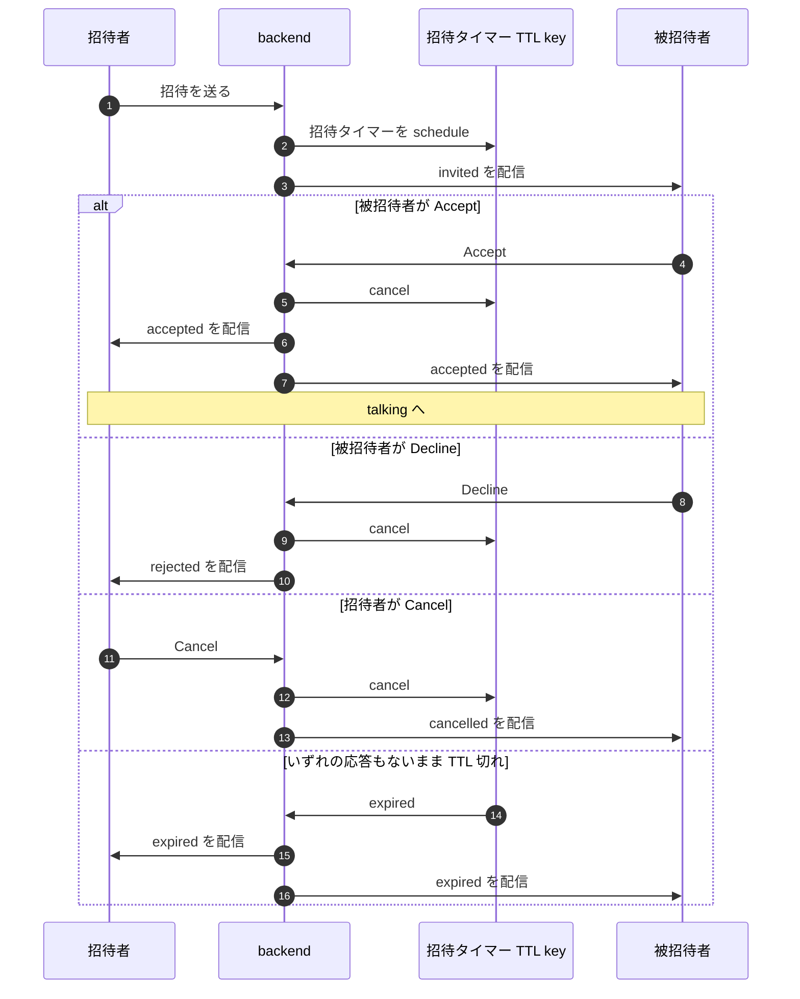
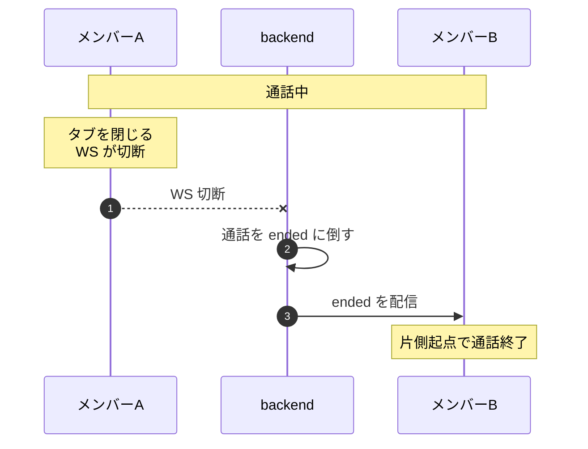

# 07 双方向状態同期

## 答える問い

廊下トークのように 1 対 1 の双方向のやり取りが要る機能で、SSE では成立しない 「片方の意思表示が もう片方の状態を駆動する」 性質を WebSocket でどう設計するか
招待 と 通話 の状態遷移、招待タイマーと TTL 切れ、WS 切断時のロールバックの全体像を どう描くか

## 前提知識

図 01 の WS の選定理由、招待や応答のような双方向のやり取りが要るときに WS を選ぶ判断
図 04 の dispatch 決定論性、招待タイマーの TTL 切れも 多 instance では 1 instance だけが fire を担当する

## 読了後に分かること

- 招待 の状態遷移、idle と invited と accepted と rejected と expired と cancelled
- 通話 の状態遷移、talking と ended
- 招待タイマー の TTL 切れによる自動 expired と、Accept Decline Cancel 接続断 でのキャンセル経路
- WS 切断時に通話側を end に倒すロールバック
- SSE では成立しない 「双方向の状態駆動」 が WS で どう自然に書けるか

## 図

## 解説

WebSocket が SSE と決定的に違うのは、片方の クライアントの意思表示が もう片方の状態を駆動する 関係を素直に書けること
廊下トークの招待は その典型で、招待者の Send が 被招待者の状態を invited に遷移させ、被招待者の Accept が 招待者の状態を accepted に遷移させる
SSE で 同じことを書こうとすると、別の HTTP エンドポイントで 操作を受けて SSE で結果を流す という二重立てになり、状態の対称性が失われる
WS なら 1 本の接続で 双方向に書ける

招待の状態遷移は 5 つの終端を持つ
accepted と rejected は 被招待者の意思表示で決まる
cancelled は 招待者が出した招待を 自分で取り消す経路
expired は 一定時間 応答がなかった場合の自動的な終端、招待タイマーの TTL 切れで起きる

招待タイマーは 図 04 の dispatch 決定論性 と同じ仕組みに乗る
schedule の瞬間に TTL key と owner side key を書き、TTL 切れの瞬間に 1 instance だけが fire を担当して expired を流す
Accept や Decline や Cancel が来たら、本体 TTL key と owner key の両方を 即 DEL して タイマーを消す
WS 接続が切れた場合も、招待中なら 自動的に cancelled 扱いに倒す経路を入れておく、招待者の WS が切れた招待は 残しておく意味が無いため

通話の状態は 単純に 2 つだけ
Accept で talking に入り、終了ボタン または 片側の WS 切断で ended に倒す
ended は終端なので そこから戻らない、再度繋ぐ場合は 新しい通話セッションとして 別の招待から始める

WS 切断時のロールバックは 双方向状態同期で 最も気を使うところ
切断は ネットワーク揺らぎでも起きうるが、通話は 揺らぎを吸収して 続行できる仕組みを取らない設計を採る
理由は 1 対 1 の通話は 片側の存在保証がなくなった瞬間に 続行する意味が無くなる、すぐに ended を流して もう一方に伝えるほうが ユーザ体験として誠実
これは Vibe の在席判定 と対極の設計判断、Vibe では grace で揺らぎを吸収するが、通話では 即 ended に倒す

招待と通話を別々の状態機械として持つ理由は、ライフサイクルの長さが まったく違うから
招待は 数秒から十数秒で終わる短命な状態機械、通話は 数分から長くて数時間続く可能性がある状態機械
これらを 1 つの状態機械に詰め込むと 遷移が爆発し、保守が苦しくなる、責務分離した方が読みやすい

「招待中の招待者の WS が切れたとき」と 「通話中の片側の WS が切れたとき」の 2 つは 動きが違うので 注意して読む
前者は 招待を cancelled に倒す、後者は 通話を ended に倒す、それぞれ別の状態機械の遷移として整理する

## 用語ノート

**双方向通信** クライアントとサーバのどちらからも任意のタイミングでメッセージを送れる通信
WebSocket が代表

**招待タイマー** 招待を送ってから自動的に expired にするまでの待機時間を司るタイマー
TTL key で表現する

**TTL 切れによる自動 expired** 招待タイマーの TTL が切れた瞬間に backend が expired を流す経路
応答が来なかった招待を片付ける

**WS 切断時のロールバック** WebSocket の接続が切れた瞬間に関連する状態を妥当な終端に倒す処理
招待中なら cancelled、通話中なら ended

**状態機械** 取りうる状態とそれらの間の遷移を限られた集合で表現する設計
招待と通話を別々の状態機械として持つ

**終端** 状態機械の中で 「そこから戻らない」状態
accepted や rejected や ended が該当する

## 実装の踏み込み先

- 招待の状態遷移（backend の application 層 Hallway、招待の usecase 群と broadcaster）
- 通話の状態遷移（backend の application 層 Hallway、通話開始と終了の usecase 群）
- WS 接続管理（backend の infrastructure 層 transport の WS 部分、切断時のロールバック呼び出し）
- 招待タイマー（backend の infrastructure 層 timer、図 04 の dispatch と同じ owner side key 方式を採用）
- frontend 側の状態保持（frontend の features 層 Hallway、招待と通話の状態を別々に持って描画）
