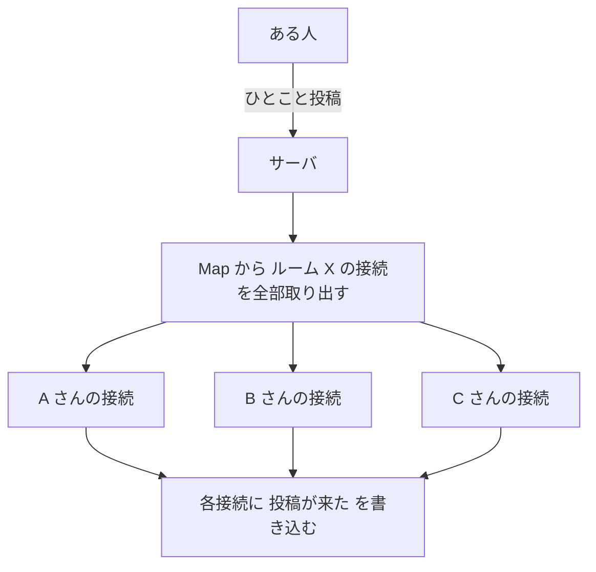
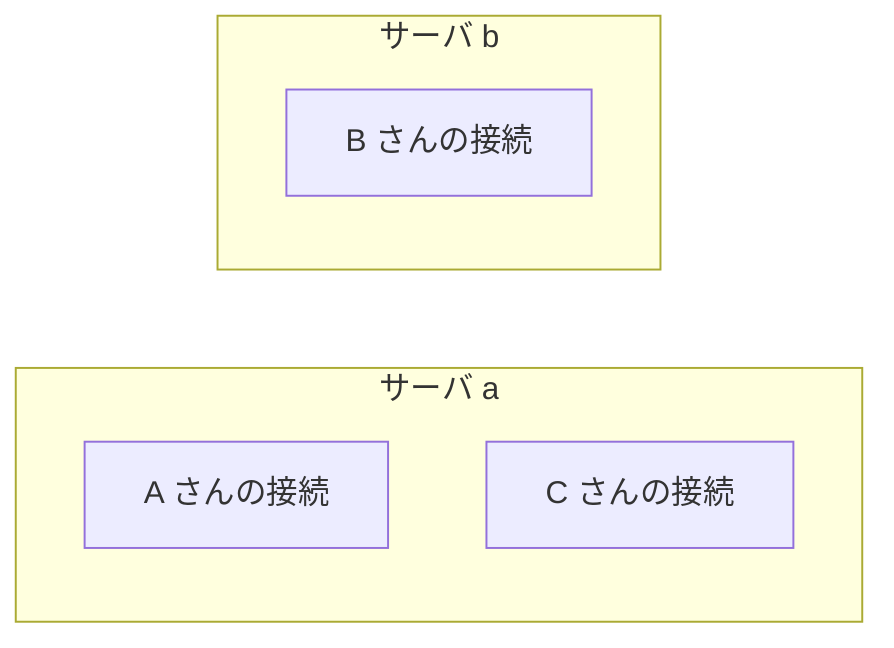
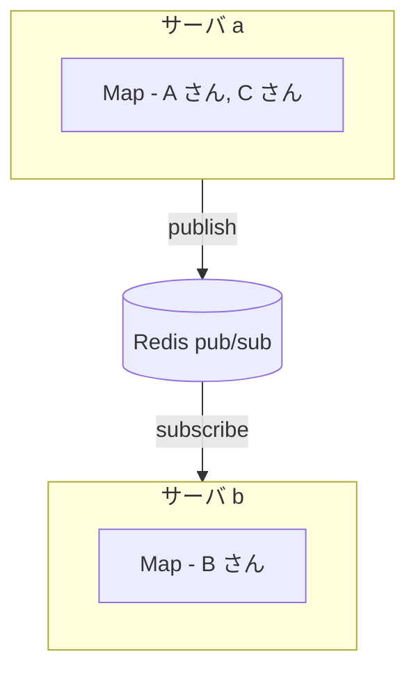
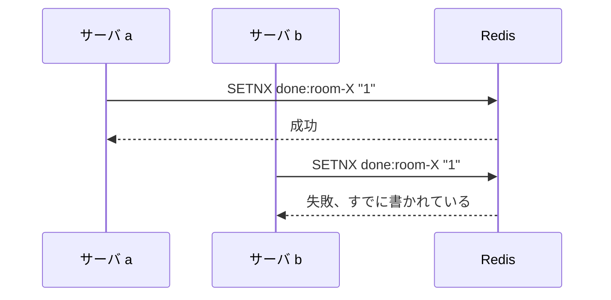
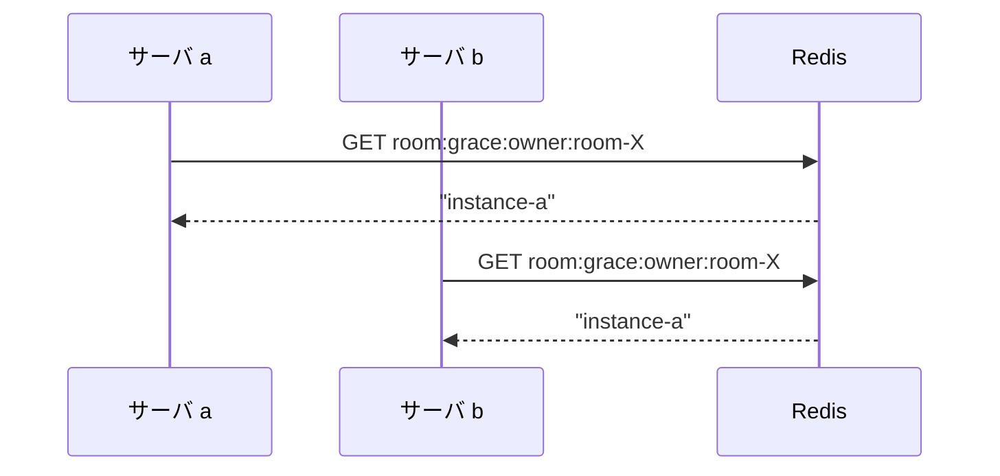
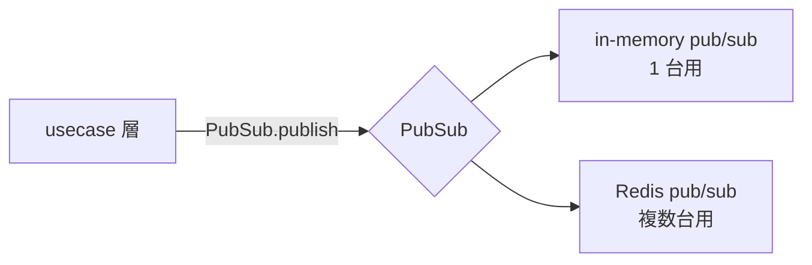

# 第 7 章 サーバが複数になると何が変わるか

## この章で答える問い

ここまでは「サーバ 1 台」を暗黙の前提にしてきました

ルームに今いる人を `Map<RoomId, Connection[]>` のような構造で覚えていれば、誰かが投稿したことを全員に届けるのは、Map から接続を全部取り出して順に書き込むだけで済みます

ところが、サービスを成長させるとサーバを複数台に増やしたくなります

利用者が増えてきて 1 台では負荷が捌けなくなった、あるいは特定リージョンで遅延を減らしたくて複数地点にサーバを置きたい —— こうした事情です

このとき、それまで Map で動いていた配信が、一気に壊れます

この章では、なぜ壊れるのか、それをどう直すのかを順に見ていきます

## 1 台のうちは Map で済む

サーバが 1 台のとき、`Map<RoomId, Connection[]>` のような単純な構造があれば配信は完結します

ある人が「ひとこと」を投稿したとします

サーバ自身が全員の接続を握っているので、「届けたい人」と「実際に書き込む口」の対応が完結しています

## 2 台目を立てた瞬間に壊れる

ここで、サーバを 2 台に増やすことを考えます

サーバ a と サーバ b の 2 台です

ロードバランサが新しい接続をどちらかに振り分けます

ある時点で、A さんと C さんはサーバ a の Map に繋がっていて、B さんはサーバ b の Map に繋がっているとします

ある人が「ひとこと」を投稿したとして、その POST リクエストはロードバランサで振り分けられて、サーバ a が受け取ったとしましょう

サーバ a は自分の Map から ルーム X の接続を取り出します

そこには A さんと C さんの接続しかありません

サーバ b の Map にいる B さんには、投稿が届きません

これが、Map ベースの配信が 2 台目を立てた瞬間に壊れる理由です

## sticky session で解決しないのはなぜか

ひとつの解決策に、同じルームの人を必ず同じサーバに振り分ける sticky session があります

ルーム X に入る人は全員サーバ a に固定すれば、Map の中身は揃います

ただ、これは少し残念な選択です

ひとつめ、サーバ a が壊れた瞬間にルーム X が全停止します

ふたつめ、ルームのサイズに偏りがあると、サーバ間の負荷が均等になりません

みっつめ、デプロイのたびに「同じルームを同じサーバに送る」仕組みを維持し続ける必要があります

仕組みとしては動きますが、複数サーバの自由度を捨てる選択になります

## 配信ハブを外に出す

そこでりもどきが採るのは、Map をサーバの中に閉じ込めず、各サーバの外に「配信ハブ」を 1 つ置く形です

具体的には、Redis の pub/sub を中継として使います

POST を受け取ったサーバ a は、自分の Map に書き込む前に、Redis に「ルーム X に投稿が来た」と publish します

すべてのサーバが同じトピックを subscribe しているので、サーバ b にも同じ通知が届きます

各サーバは、自分の Map にある接続にだけ書き込みます

サーバ a の Map には A さんと C さんがいるので、そこに書きます

サーバ b の Map には B さんがいるので、そこに書きます

結果として、3 人すべてに投稿が届きます

「届けたい人」と「実際に書き込む口」を、Redis 中継を介して 2 段に分けることで、サーバが何台になっても同じロジックで動かせるようになります

## sticky session が不要になる理由

この構成では、誰がどのサーバに繋がっていてもかまいません

ロードバランサは何の制約もなく振り分けて良く、その人がどのサーバの Map にいるかを意識する必要もありません

各サーバは、自分の手元にある接続にだけ書き込む、という自分の責任を果たすだけで済みます

新しいサーバを追加しても、既存サーバを 1 台落としても、Redis pub/sub の経路は変わらないので、配信は継続します

これが、sticky session を捨てて済む理由です

## ルームの寿命のような「1 度だけ」の処理

配信が複数サーバに広がると、もうひとつ別の難題が出てきます

「全員に届ける」ものはどのサーバが受け取っても問題ありませんが、1 度だけ走らせたい処理はそうはいきません

代表例が、ルームから最後の人が抜けたときの片付け処理です

第 6 章で扱った 30 秒の grace の終了に相当します

この片付けは、複数サーバの中の 1 つだけが走らせる必要があります

複数のサーバが同時にルーム X を片付けようと動いたら、ルームを 2 重に消したり、配信を 2 重に出したりする可能性が出ます

複数の中から 1 つだけが走るやり方をどう選ぶか —— ここに dispatch という観点が出てきます

## アンチパターン SETNX done lock

最初に思いつくのは、最初に手を挙げた 1 サーバだけが走る、というロックの仕組みです

Redis には `SETNX` というコマンドがあって、まだ誰も書いていないキーにだけ値を書けます

ロックを取れたサーバだけが片付けを走らせる、ように見えます

ところが、この仕組みは race を産みます

タイマー切れの expired notification を、サーバ a と サーバ b の両方が同時に受け取ったとします

通信状況によっては、両方がロックを取ったと判定する一瞬が生まれます

通信が往復している間に、片方が完了してロックを解除すると、もう片方がさらにロックを取り直して、結果として処理が 2 回走ります

ロックの取り合いを「実際に処理を持っている側」と独立して走らせると、こういう確率的なズレが紛れ込んでしまいます

## 解 owner side key と GET 突合

りもどきが採っているのは、ロックの取り合いではなく、最初に予定を入れた側が誰かを記録しておく仕組みです

タイマーを張るときに、Redis に 2 つのキーを置きます

ひとつは TTL のある「予定キー」です

たとえば `room:grace:room-X` という名前で、graceMs の TTL を持って書かれます

もうひとつは「オーナー印キー」です

たとえば `room:grace:owner:room-X` という名前で、その予定を立てたサーバの instanceId を値として書きます

タイマーを張った時点で、Redis には次の 2 つのキーが置かれます

- `room:grace:room-X`
  - TTL 30 秒で expire する予定キー
- `room:grace:owner:room-X`
  - 値は `instance-a`、TTL は 5 分の余裕を持たせたオーナー印キー

タイマー切れの expired notification は、Redis を subscribe しているすべてのサーバに同時に届きます

各サーバはまず、オーナー印キーを `GET` で読みます

返ってくる値はどのサーバにも同じものです

各サーバは「自分の instanceId と値が一致するか」をローカルで判定します

サーバ a だけが、自分が予定を立てたサーバなので自分が走ると判定して、片付けを走らせます

サーバ b は値が一致しないので、何もしないまま静かに終わります

ロックの取り合いではないので、確率的なズレが入り込む隙間がありません

## 2 つの考え方の違い

SETNX 方式は、ロックを取れたら走る、という考え方です

owner side key 方式は、最初から走る人を決めておく、という考え方です

複数サーバの dispatch を考えるときは、決定の判断材料が各サーバのローカルだけで完結するかを確認すると、確率的なズレが入り込む隙間に気付きやすくなります

## りもどきの構成

りもどきは `STORAGE_DRIVER` という環境変数で、in-memory と Redis のどちらに倒すかを切り替えます

開発時は in-memory で 1 サーバとして動かし、本番は Redis を中継に複数サーバ構成へ展開できます

usecase 層は `PubSub` という port 型を介して配信を行うため、in-memory なのか Redis なのかを意識しません

この境界線が、複数サーバへの拡張を「設定の切り替えだけで済ませる」ための抽象化になっています

## 実装はどこから読めるか

### PubSub の port

- `apps/backend/application/shared/ports/pubsub.ts`

`publish`、`subscribe`、`closeByPrefix` の 3 メソッドだけを持つ port 型です

usecase 層と broadcaster はこの型しか知らず、配信先がメモリなのか Redis なのかを問いません

### 2 つの実装

- `apps/backend/infrastructure/pubsub/in-memory.ts`

開発時に使われる、トピックごとの handler 配列を保持するシンプルな実装です

- `apps/backend/infrastructure/pubsub/redis.ts`

ioredis を使った Redis pub/sub 実装です

publisher と subscriber を別の接続で持っているのは、Redis の SUBSCRIBE 中の client が他コマンドを受け付けない仕様への対応です

### dispatch の owner side key

- `apps/backend/infrastructure/timer/redis/expired-listener.ts`

Redis のキースペース通知 `__keyevent@db__:expired` を購読し、prefix で機能ごとに dispatch する専用 service です

各 Redis timer 実装が constructor で `subscribe(prefix, handler)` を呼んで dispatch table を構築します

- `apps/backend/infrastructure/timer/redis/room-lifecycle-grace.ts`

ルーム閉鎖の grace に owner side key 方式を適用しています

`schedule` で予定キーとオーナー印キーの 2 つを置き、`handleExpired` でオーナー印キーを `GET` して自分の instanceId と突き合わせ、一致した 1 サーバだけが片付けを走らせます

## まとめ

サーバが 1 台のうちは、`Map<RoomId, Connection[]>` の中に全員の接続が揃っているので、配信は単純です

複数台に増やすと、Map がサーバごとにバラバラになるため、配信は外に出した pub/sub を中継に成り立つ形に組み替える必要があります

「全員に届ける」ものは pub/sub で良いですが、1 度だけ走らせるものはロックの取り合いではなく、最初から走る人を決めておく owner side key 方式が、確率的なズレを避ける素直な選択です

りもどきは `STORAGE_DRIVER` で in-memory と Redis を切り替えられる構造で、usecase 層が同じコードのまま 1 台にも複数台にも適応できる形になっています

これで、リアルタイム通信を成立させているしくみを 7 章ぶん辿ってきました

「画面が勝手に動く」という体験から始まって、SSE と WebSocket の使い分け、heartbeat と retry と close 検知の 3 つの手当て、招待と通話の双方向対称性、いる人を 2 段で数える仕組み、そして複数サーバへの拡張まで、いくつかの層が積み重なって動いていることが見えてきました

書く側として手元のコードに戻るときに、この章立てを「何の問題を解いているか」の地図として使ってもらえたら、この資料の役目は果たせています
